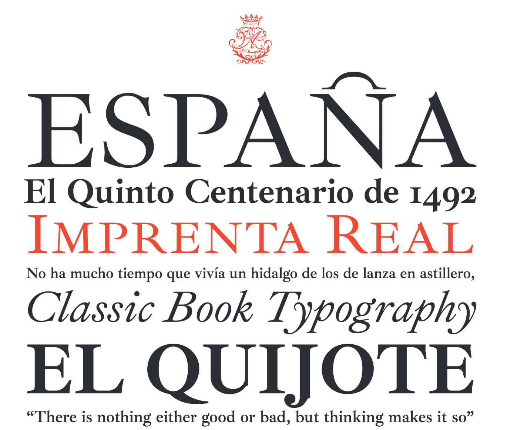

# Ibarra Real Fonts

This font is the fruit of a wider initiative dating back to 2007, when Calcografía Nacional (Spain’s national and historical engraving workshop) organised a project directed by José María Ribagorda focusing on and highlighting Spain’s typographic heritage, with the support of Spain’s Ministry for Industry.

Nowadays, nobody questions the significance and growth of the Spanish language as a tool for communication between different countries and cultures around the world, and the intangible capital as well as the economic impact involved in the use of signs that could be recognised as belonging to our cultural heritage. 

This project is aimed at filling an important gap, for the myriad of texts now written in the Spanish-speaking community use font types created in other cultural milieus. This is why we believe it is important, as our language becomes more relevant, to associate this reality with the recovery of the Imprenta Real types that were developed in Spain in the eighteenth century. Thus we will be able to make them better known, making them more accessible by means of the digital media available to us now. 

In 2018, the sources of the Ibarra Real fonts became available under the SIL Open Font License. This means that it will not only be freely usable and widely distributed, but the source files can be a reason for study and adaptation. The production of this design was always aimed at the patrimonial and cultural recovery of one of the best examples of Spanish writing and Spanish printing. The Royal Academy of Fine Arts of San Fernando, sponsor of the project through the National Calcography, thus assures its character of public and common patrimony of all, and its distribution has been always free of charge.

Before reaching this stage, José María Ribagorda decided in 2015 that the first collaborator in touching the design should be Octavio Pardo. Octavio was the first student of the prestigious University of Reading MA Typeface Design programme to study Ibarra Real. It is logical that he was the person who José María asked to revise the font and improve it from his personal criteria, free of constraints. It has been a pleasure to observe his work, and to discuss the project with him. Changes included expanding the glyph set for more Latin languages, improving legibility, reworking spacing, and retouching of some glyphs. The italics were adjusted in terms of apparent slant angle. 

The first release of the project included not only characters, but also ornaments made by celebrated Latin-American and Spanish designers: Manuel Alvarez Junco, Andreu Balius Planelles, Didac Ballester, Paco Bascunan, Jose Maria Cerezo, Alberto Corazon, Oyer Corazon, Pablo Cosgaya, Ruben Fontana, Javier Garcia del Olmo Jose Gil Nogues, Pepe Gimeno, Fernando Gutierrez, Juan Martinez, Laura Meseguer, Juan Antonio Moreno, Juan Nava, Miguel Ochando, Joseph Patau Bellart, Alejandro Paul, Marc Salinas, Emilio Torne, Alex Trochut, Roberto Turegano Moratalla. 

This second version has been Revised, Opened, and Extended, or as it would be in Spanish, "Revisada, Abierta y Extendida." Also the ornaments of the first version have not been incorporated, but may be included in a future update when their authors allow them to be distributed under the SIL Open Font License.
